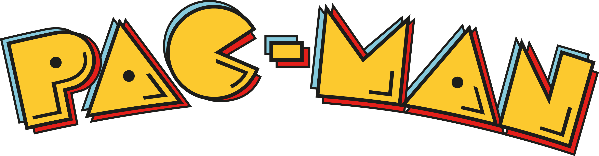

# Pacman-Game
 

  

  <h3 align="center">Pacman Game</h3>

## About The Project

Re-created the iconic pacman game using python’s pygame library with the functionality of the game kept constant.
 
 

https://github.com/zunaidhossain/Pacman-Game/assets/96568936/f9558721-c252-4319-bfdf-4f74a4e103cb

## Built With

* Python
* PyGame

## Author

* **Zunaid Hossain** - *A Tech Enthusiast* - [Connect with me on LinkedIn](https://www.linkedin.com/in/zunaid-hossain-70b891235/)

